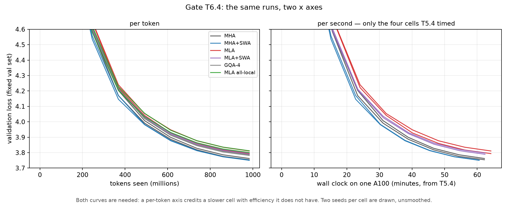

# Attention ibrida SWA + MLA su nanoGPT: implementazione e confronto controllato

La sliding window attention (SWA) e la latent compression (MLA) risolvono problemi
diversi e i loro risparmi di memoria si moltiplicano. Il costo in qualità lo paga quasi tutto la
compressione, non la window, e a questa scala la configurazione più conveniente non è l'ibrido ma
`MHA + SWA`. L'ibrido diventa competitivo solo con l'absorbed decode, e solo quando conta il
numero di sequenze tenute in memoria.

## Indice

1. [Obiettivo](#1-obiettivo)
2. [Introduzione](#2-introduzione)
3. [Lavori correlati](#3-lavori-correlati)
4. [Metodi](#4-metodi)
5. [Setup sperimentale](#5-setup-sperimentale)
6. [Risultati](#6-risultati)
7. [Conclusioni](#7-conclusioni)
8. [Riproduzione](#8-riproduzione)
9. [Riferimenti](#9-riferimenti)
10. [Licenza MIT](#10-licenza-mit)

---

## 1. Obiettivo

> *"For the coding challenge, your task is to implement a hybrid attention mechanism that combines
> both Sliding Window Attention (arxiv.org) and Multi-head Latent Attention (arxiv.org, Section
> 2.1). We recommend beginning with a minimal codebase like nanoGPT (github.com) to get started. We
> also ask to compare this hybrid mechanism against standard attention, outlining the main
> advantages and main drawbacks regarding MLA and SWA."*


## 2. Introduzione

Partendo da nanoGPT [1] sono stati implementati MLA, SWA, GQA, una **KV cache dimensionata per
layer** (ring buffer di $W$ token nei layer locali, completo nei globali) e l'**absorbed decode**
di MLA, con test automatici e un apparato di misura per qualità, memoria, velocità e long context.

**Cosa si intende per ibrido.** SWA decide *quali* posizioni una query vede, MLA *come* sono
rappresentati key e value. L'ibrido è **fra layer**: tutti i layer usano MLA e si alternano fra
locali (window di $W$ token) e globali secondo il pattern `LLLG`, con l'ultimo layer globale, come
in Gemma 2 e 3 [9, 10]. È stata misurata anche la lettura alternativa, **all-local**, con tutti i
layer locali. Per attribuire ogni effetto a un meccanismo, il confronto è una **grid 2×2** (MHA/MLA
× globale/locale), che rende misurabile anche la loro interazione.

Il confronto include, oltre all'attention standard (MHA), anche **GQA**, lo standard de facto per
ridurre la KV cache e il termine di paragone contro cui DeepSeek-V2 presenta MLA.

Sono stati addestrati **18 modelli da 51 M di parametri** su 983 M token di FineWeb-Edu [20], su
GPU NVIDIA A100. Tutte le misure di efficienza sono state fatte nello stesso job per tutte le cell.

---

## 3. Lavori correlati

Ogni voce si espande con un clic.

<details>
<summary><b>Attention e KV cache</b></summary>

L'attention [2] calcola $\mathrm{softmax}\left(QK^\top/\sqrt{d} + M\right)V$, con $M$ causal mask.
La multi-head attention (MHA) usa $n_h$ head da $d_h$ dimensioni. Costa $O(T^2)$ in training e
prefill; in decode tiene in cache key e value, $2 \cdot n_h \cdot d_h$ elementi per token per layer.
Con long context e batch grandi ogni decode step è dominato dalla lettura della cache [3].

</details>

<details>
<summary><b>MQA e GQA</b></summary>

MQA [4] condivide un'unica coppia key/value fra tutte le head, con un calo di
qualità. GQA [5] divide le query head in $n_{kv}$ group, ognuno con la sua coppia: cache
$2 \cdot n_{kv} \cdot d_h$, qualità vicina a MHA con pochi group. È lo standard de facto, usato da
Llama 2 e Llama 3 [6, 7], Mistral 7B [8], Gemma 2 e 3 [9, 10] e Qwen2 [12]: poche righe di codice,
nessuna projection in più, supporto nativo nei kernel [14]. Riduce la cache rinunciando a head,
cioè a capacità.

</details>

<details>
<summary><b>Sliding Window Attention</b></summary>

Ogni query vede solo gli ultimi $W$ token ($0 \le i - j < W$). L'idea
di un pattern di attention sparso viene da [15, 16]; Mistral 7B [8] la usa con $W = 4096$.

- **Calcolo:** $O(T \cdot W)$ invece di $O(T^2)$, se il kernel salta i blocchi masked.
- **Memoria:** la cache di un layer locale diventa un *ring buffer* di dimensione costante.
- **Prezzo:** i token oltre la window arrivano solo attraverso i layer successivi.

Gemma 2 e 3 alternano layer locali e globali (1:1 e 5:1) per mantenere l'accesso diretto a tutto
il context. Qui la window conta $W$ posizioni **incluso** il token corrente.

</details>

<details>
<summary><b>Multi-head Latent Attention</b></summary>

DeepSeek-V2 [11], usata anche in DeepSeek-V3 [13], **comprime** key e value in un latent condiviso
$c^{KV} = W^{DKV} h$ di rank $d_c$, da cui ricostruisce $k^{C} = W^{UK} c^{KV}$ e
$v = W^{UV} c^{KV}$. In cache va solo il latent, con una RMSNorm applicata sopra.

</details>

<details>
<summary><b>Decoupled RoPE</b></summary>

RoPE [17] ruota coppie di dimensioni di un angolo proporzionale alla posizione, così che
$q_m^\top k_n$ dipenda solo da $m - n$. Ruotare $k^{C}$ inserirebbe una rotazione dipendente dalla
posizione fra la query e $W^{UK}$, e in decode bisognerebbe ricostruire tutto il prefix.
DeepSeek-V2 usa quindi un **positional channel separato** (decoupled RoPE):

- **Due parti:** query e key sono $[\,\text{content}\ ;\ \text{RoPE}\,]$, con la parte content mai
  ruotata.
- **Key posizionale condivisa:** $k^{R}$ (dimensione $d^R_h$) è calcolata da $h$ e condivisa fra
  le head.
- **Scala del softmax:** $1/\sqrt{d_h + d^R_h}$.
- **Cache per token per layer:** $d_c + d^R_h$ elementi.

</details>

<details>
<summary><b>Absorption (decode sul latent)</b></summary>

Poiché

$\displaystyle q^{C\top}\left(W^{UK} c\right) = \left(W^{UK\top} q^{C}\right)^{\top} c \qquad \text{e} \qquad \sum_s a_s W^{UV} c_s = W^{UV} \sum_s a_s c_s ,$

la ricostruzione può essere applicata alla **query** e all'**output** invece che a **ogni token in
cache**. L'attention gira direttamente sul latent: stessa funzione, stessi weights, ordine diverso.
La forma naive paga la projection per token in cache ($S$), quella absorbed per query ($T$). Il
break-even è a

$\displaystyle T^{\ast} = \frac{d_c\,(d_{\text{nope}} + d_v)}{2d_c + d^R_h - d_{qk} - d_v} = 36.6 \ \text{query}$

nella configurazione usata. Il decode ($T = 1$) vuole la forma absorbed; prefill e training quella
naive.

</details>

<details>
<summary><b>Kernel</b></summary>

- **FlashAttention** [14, 18] supporta window e GQA, ma richiede la stessa head dimension per
  $q$, $k$ e $v$.
- **FlexAttention** [19] salta i blocchi fuori window, ma in PyTorch 2.6 vuole dimensioni potenza
  di due.
- **FlashMLA:** i kernel MLA di produzione richiedono GPU più recenti dell'A100 e non sono stati
  usati in questo report.

</details>

---

## 4. Metodi

Il repository è un fork di nanoGPT. Training loop, scheletro del modello, `configurator.py` e
preparazione dati sono di nanoGPT; il resto è stato scritto per questo lavoro.

<div align="center">

| file | ruolo |
|---|---|
| `model.py` | MHA, GQA, MLA, mask SWA, pattern dei layer, RoPE, backend di attention, absorbed decode |
| `kv_cache.py` | KV cache dimensionata per layer |
| `train.py`, `configurator.py` | nuovi hyperparameter, validation set fisso, seed di training |
| `cells.py`, `config/grid_*.py` | le cell sperimentali |
| `bench_inference.py`, `bench.py` | memoria, latenza, batch massimo, throughput di training |
| `probe_tasks.py`, `probe_longctx.py` | probe sintetici di long context |
| `analysis/*.py`, `scripts/*.py` | statistica, tabelle e figure; oracle di regressione contro nanoGPT |
| `tests/` | 21 file di test |

</div>

<details>
<summary><b>4.1 Attention</b></summary>

**Un solo entry point.** `attend()` in `model.py` è l'unica funzione che calcola l'attention,
per tutte le varianti. La scelta locale/globale entra **solo** come `is_local`/`window`: MLA cambia
come si producono $q$, $k$ e $v$, SWA quali posizioni sono visibili.

**Backend.**

- **`flex`** (FlexAttention) per **tutti** i training: il kernel è costante fra le cell, quindi le
  differenze di velocità sono dell'architettura. Lo score di MLA (48) viene portato a 64 con zeri,
  con la scala passata esplicitamente ($1/\sqrt{48}$): senza, il padding la sposterebbe in silenzio.
- **`sdpa_mask`**, SDPA con dense mask: è l'**oracle** dei test e il backend di **tutte le misure
  di inference**.

**`MultiHeadLatentAttention`** segue le equazioni di DeepSeek-V2:

- **Cache:** contiene solo $c^{KV}$ e $k^{R}$.
- **$k^{R}$:** calcolata da $h$, non dal latent, e condivisa fra le head.
- **Scala:** $1/\sqrt{d_{\text{nope}} + d_{\text{rope}}}$.
- **RMSNorm sul latent:** calcolata in fp32.
- **Query:** non compresse, come DeepSeek-V2-Lite.
- **RoPE channel,** con `rope_mode`:
  - `additive` (default, quello del paper): content a larghezza piena, $d_{qk} = 48$;
  - `carved`: channel ricavato dentro la head, $d_{qk} = d_v = 32$, nessun padding;
  - `reconstructed`: nessun channel.
- **Absorbed decode** (`_forward_absorbed`): legge `kv_up` come $n_h$ blocchi separati, senza
  mescolare le head, e non aggiunge parametri. `absorb_mode='auto'` applica l'absorption sotto
  $T^{\ast}$, cioè in ogni decode step.

**Dettagli che evitano bug silenziosi.**

- `is_causal=True` non è mai usato: SDPA ignorerebbe la mask e la window sparirebbe.
- **RoPE:** le frequenze sono calcolate sulla dimensione a cui la rotazione è applicata, con
  posizioni sempre assolute.
- **Init:** la scala $1/\sqrt{2L}$ delle residual projection è applicata per marker esplicito e non
  per nome, altrimenti l'output projection di MLA ne resterebbe esclusa.
- **FLOPs e MFU:** tengono conto della window e delle larghezze diverse di score e value.

</details>

<details>
<summary><b>4.2 KV cache dimensionata per layer (<code>kv_cache.py</code>)</b></summary>

Ogni layer ha la sua capacità:

- **locale:** $W$, ring buffer a memoria costante;
- **globale:** $T_{\max}$, un buffer che se venisse superato solleva un errore invece di diventare
  in silenzio una window.

**Contenuto:** $k$ e $v$ per MHA/GQA, solo $c^{KV}$ e $k^{R}$ per MLA. **Lettura:** in ordine
cronologico, con una zero-copy view finché il buffer non fa wrap-around. **Posizioni:** le key
sono ruotate alla loro posizione assoluta prima della scrittura.

</details>

<details>
<summary><b>4.3 Training (<code>train.py</code>)</b></summary>

nanoGPT stima la validation loss su batch casuali diversi a ogni valutazione. Architetture diverse
consumano l'RNG in modo diverso all'init, quindi **ogni cell validava su token diversi**, con un
rumore dello stesso ordine delle differenze cercate (0.01–0.05 nats). `build_fixed_val` estrae 200
batch una sola volta, identici per ogni cell e seed, e ne stampa un fingerprint, identico in tutte
le run. `train_seed` rende il seed configurabile.

</details>

<details>
<summary><b>4.4 Test</b></summary>

La suite completa dà **304 test passati su A100** e 221 passati più 44 saltati su CPU. I test
confrontano il fast path con l'oracle denso o con la definizione matematica.

<div align="center">

| gruppo | file | cosa garantisce |
|---|---|---|
| meccanismi | `test_swa`, `test_backends`, `test_pattern`, `test_rope`, `test_mla`, `test_gqa_native`, `test_absorption`, `test_flash` | window esatta di $W$ token; FlexAttention ≡ oracle; RoPE corretta; shape, scala e gradienti di MLA; GQA nativa ≡ ripetuta; absorbed decode ≡ naive per 48 step |
| cache | `test_kv_cache`, `test_cache_parity`, `test_cache_capacity`, `test_cache_zero_copy`, `test_decode_masks` | incremental decode ≡ forward completo (errore < 1e-4, anche dopo il wrap-around del buffer); memoria ≡ formula; zero-copy |
| misure | `test_bench_no_grad`, `test_bench_reference`, `test_sdpa_kernel_policy`, `test_cells` | benchmark senza autograd; rapporti rispetto a MHA; scelta del kernel che non cambia i risultati |
| training | `test_fixed_val`, `test_train_checkpoints`, `test_mla_init`, `test_probe_tasks` | validation set identico fra cell; hyperparameter nei checkpoint; task sintetici ben formati |

</div>

</details>

---

## 5. Setup sperimentale

**Hardware e software.**

- **GPU:** NVIDIA A100 80 GB e 40 GB, stessa architettura sm80. Tutte le misure di efficienza su
  80 GB.
- **Software:** Python 3.12, PyTorch 2.6.0+cu124; dipendenze bloccate in `uv.lock`.

<details>
<summary><b>Parametri di modello e training (clicca per espandere)</b></summary>

<div align="center">

| gruppo | parametro | valore |
|---|---|---|
| modello | layer / head / `n_embd` | 8 / 16 / 512 (`head_dim = 32`), context 1024, vocabulary GPT-2 |
| | posizioni | RoPE ($\theta = 10\,000$) in ogni cell |
| SWA | window / pattern | $W = 256$ / `LLLG`, ultimo layer globale |
| MLA | latent / channel | $d_c = 256$; $d_{\text{nope}} = 32$, $d_{\text{rope}} = 16$, $d_v = 32$; query non compresse |
| GQA | KV head | 4 (cache 256 elementi contro 272 di MLA: pari memoria) |
| training | dati | FineWeb-Edu `sample-10BT`, 2 shard (1.5 B token, documento mediano 629 token) |
| | budget | $491\,520$ token/iter $\times$ 2000 iter $\approx$ **983 M token** |
| | optimizer | AdamW (0.9, 0.95), wd 0.1, lr 6e-4, warmup 200, cosine → 6e-5, bf16, FlexAttention, `torch.compile` |
| | seed | 1337 e 2024 (più 3141 per ④ e ⑨) |

</div>

</details>

$d_c = 256$ rende MLA a pari parametri con MHA (+0.27% sul corpo del transformer). GQA-4 ha invece
il 12.5% di parametri in meno: è pareggiata sulla memoria, non sulla capacità.

<details>
<summary><b>Le cell sperimentali (clicca per espandere)</b></summary>

<div align="center">

| | cell | attention | pattern | cosa isola |
|---|---|---|---|---|
| ① | `1_mha_full` | MHA | `G` | baseline |
| ② | `2_mha_swa` | MHA | `LLLG` | **SWA** |
| ③ | `3_mla_full` | MLA | `G` | **MLA** |
| ④ | `4_mla_swa` | MLA | `LLLG` | **l'ibrido** |
| ⑤ | `5_gqa_full` | GQA-4 | `G` | controllo a pari cache |
| ⑦ | `7_mla_all_local` | MLA | tutti `L` | ibrido all-local |
| ⑧ ⑨ | `*_carved*` | MLA, carved channel | `LLLG` | costo del carved RoPE channel |

</div>

La cell ⑥ (`6_gqa_swa`: GQA con 2 KV head e pattern `LLLG`) è usata solo nei test della cache
(`tests/test_cache_parity.py`) e non è stata addestrata.

</details>

---

## 6. Risultati

**Le configurazioni nelle tabelle.**

<div align="center">

| nome | cell | cos'è |
|---|---|---|
| MHA | ① | attention standard: ogni layer vede tutto il context e tiene in cache key e value di tutte le 16 head |
| +SWA, MHA + SWA | ② | MHA con sliding window: 6 layer su 8 vedono solo gli ultimi 256 token, gli altri 2 tutto il context (`LLLG`) |
| MLA | ③ | key e value compressi in un latent condiviso da 256 elementi; ogni layer vede tutto il context |
| MLA + SWA, ibrido | ④ | MLA in tutti i layer, con la stessa alternanza `LLLG` di ② |
| GQA-4 | ⑤ | le 16 query head condividono 4 coppie key/value: cache 4 volte più piccola di MHA |
| all-local | ⑦ | MLA con tutti gli 8 layer a window: nessun layer vede oltre gli ultimi 256 token |
| carved | ⑧ ⑨ | come l'ibrido, ma con il RoPE channel ricavato dentro la head invece che aggiunto |

</div>

**I simboli.**

- **$T$:** context length, in token. Nelle misure di memoria e velocità è il numero di token già in
  cache quando si misura (8k = 8 192, 32k = 32 768).
- **$B$:** batch, cioè il numero di sequenze elaborate in parallelo.
- **naive / absorbed:** le due forme di decode di MLA (§3). La naive ricostruisce key e value per
  ogni token in cache, l'absorbed lavora direttamente sul latent. Le cell senza MLA hanno una sola
  forma.
- **Numeri tra parentesi:** rapporto con MHA nelle stesse condizioni.

### 6.1 Qualità

**Cosa si misura.** La validation loss è la cross-entropy sul token successivo,

$$
\mathcal{L} = \frac{1}{N} \sum_{i=1}^{N} -\ln p\left(\text{token corretto}_i\right),
$$

calcolata sullo stesso validation set per tutte le cell (§4.3). Si misura in **nats** perché usa il
logaritmo naturale; $1\ \text{nat} = 1/\ln 2 \approx 1.44$ bit. Come riferimento, la loss di MHA
(3.76 nats) corrisponde a una perplexity $e^{3.76} \approx 43$: il modello è incerto come se
scegliesse a caso fra circa 43 token. Scegliere a caso fra tutti i token della vocabulary darebbe
$\ln 50\,257 \approx 10.8$ nats.

**Come leggere la tabella.** **Più bassa è la loss, meglio è.** $\Delta$ vs MHA è la differenza con
la baseline: negativa = meglio di MHA, positiva = peggio. Poiché $e^{\Delta} \approx 1 + \Delta$ per
$\Delta$ piccolo, $\Delta$ nats equivalgono a circa $\Delta \times 100\%$ di perplexity
($+0.035 \approx +3.6\%$). La $\sigma$ fra seed, aggregata sulle sei cell, vale **0.0069 nats**: la
soglia di significatività $2\sigma$ è **0.0138**, e sotto soglia una differenza non si distingue dal
rumore del seed e non viene rivendicata. Risultati da `results/grid_summary.csv`, 12 run su 12,
nessun NaN:

<div align="center">

| cell | val loss | $\Delta$ vs MHA |
|---|---|---|
| ① MHA | 3.7579 | — |
| ② **MHA + SWA** | **3.7508** | **−0.0070** |
| ③ MLA | 3.8022 | +0.0444 |
| ④ MLA + SWA (ibrido) | 3.7932 | +0.0354 |
| ⑤ GQA-4 | 3.7840 | +0.0261 |
| ⑦ MLA all-local | 3.8063 | +0.0484 |

</div>

- **La window non costa nulla di misurabile; il costo dell'ibrido viene da MLA, non dalla
  mask.** Per MLA il learning rate non è stato ritarato e l'init scale non è pareggiata con MHA,
  quindi +0.044 va letto come limite superiore.
- **Interazione** $\Delta_{\text{ibrido}} - (\Delta_{\text{SWA}} + \Delta_{\text{MLA}})$: −0.0192 e
  +0.0153 sui due seed, media **−0.0020**. Non viene rilevata, ma due seed la risolverebbero solo
  sopra ~0.027 nats.
- **A pari cache GQA-4 batte MLA di 0.0182 nats**, sopra soglia, con meno cache e meno parametri.
- **Carved RoPE channel:** nessun costo rilevato. Rispetto a ④, la cell ⑨ ha lo stesso positional
  channel e la stessa cache, e il content dimezzato: +0.0012 su due seed, +0.0044 su tre. Toglie il
  padding e i kernel che rifiutano le shape, ed è il candidato naturale come default di
  implementazione.

**Perché l'ibrido costa +0.035.** SWA e MLA toccano cose diverse. La window toglie ai layer locali
i token lontani, ma con context 1 024 e $W = 256$ gran parte dell'informazione utile a predire il
token successivo è vicina, e un layer globale ogni quattro recupera il resto: per questo ② non
costa nulla. MLA invece comprime key e value di tutte le 16 head in un unico latent da 256
elementi, e questo limita ciò che ogni head può rappresentare in **ogni** layer. L'ibrido eredita
quindi quasi solo il costo di MLA: +0.035 contro +0.044 di MLA da sola, una differenza (0.009) sotto
soglia.



**Cosa mostra la figura.** Le curve di validation loss durante il training, due seed per cell,
senza smoothing. In entrambi i pannelli l'asse y è la validation loss sul validation set fisso
(§4.3), limitata fra 3.7 e 4.6 per rendere leggibile la parte finale del training.

- **Pannello di sinistra, per token:** sull'asse x i token visti durante il training, in milioni
  (fino a 983 M). Ci sono tutte le sei cell.
- **Pannello di destra, per secondo:** sull'asse x il wall-clock time di training su una A100, in
  minuti, dal throughput misurato in T5.4. Ci sono solo le quattro cell di cui è stato misurato il
  tempo: MHA, MHA + SWA, MLA e MLA + SWA.

**Cosa osservare.** Tutte le curve scendono e si appiattiscono, e nell'ultima parte restano quasi
parallele: il distacco fra le cell non si sta chiudendo, quindi l'ordine della tabella non dipende
dal punto in cui si ferma il training. A sinistra MHA + SWA e MHA finiscono più in basso (≈ 3.75),
le cell con MLA e GQA-4 più in alto, MLA all-local per ultima. Il pannello di destra controlla che
il confronto regga anche a parità di tempo, perché un asse per token premierebbe una cell lenta con
un'efficienza che non ha: MLA impiega qualche minuto in più (≈ 64 contro ≈ 61–62 minuti) e resta
più in alto, quindi a parità di tempo il suo svantaggio cresce, mentre MHA + SWA arriva prima e più
in basso.

### 6.2 Memoria

**Come leggere la tabella.** Ogni valore è la KV cache della cell come percentuale di quella di MHA
allo stesso $T$: **più bassa è meglio** (25% = cache 4 volte più piccola). Essendo rapporti, le
percentuali non dipendono né dal batch né dal tipo di dato. (`results/T5.1_kv_cache_analytic.csv`):

<div align="center">

| $T$ | MHA | +SWA | GQA-4 | MLA | **MLA+SWA** | all-local |
|---|---|---|---|---|---|---|
| 1 024 | 100% | 43.8% | 25.0% | 26.6% | **11.6%** | 6.6% |
| 16 384 | 100% | 26.2% | 25.0% | 26.6% | **7.0%** | 0.4% |
| 131 072 | 100% | 25.1% | 25.0% | 26.6% | **6.7%** | 0.1% |

</div>

- **I risparmi si moltiplicano esattamente:** $26.6\% \times 26.2\% = 7.0\%$ a 16k token.
- **MLA** dà un fattore costante.
- **SWA** satura al 25%, perché con long context dominano i 2 layer globali.
- **Senza layer globali** (⑦) la cache resta 1.06 MiB per sequenza a ogni lunghezza: **un solo
  layer globale basta a rendere la cache $O(T)$**.

**Perché l'ibrido arriva al 7%.** La cache vale

$$
\text{cache} = \sum_{\text{layer}} \min\left(T,\ \text{capacità del layer}\right) \times \text{elementi per token}.
$$

MHA tiene $16 \times (32 + 32) = 1024$ elementi per token per layer, MLA $256 + 16 = 272$ (26.6%).
Con `LLLG` i 6 layer locali tengono al massimo 256 token e i 2 globali tutti i $T$: a 16 384 token
la frazione è

$$
\frac{2 \cdot 16\,384 + 6 \cdot 256}{8 \cdot 16\,384} = 26.2\% .
$$

MLA riduce gli elementi per token, SWA il numero di token nei layer locali: agiscono su fattori
diversi della formula e quindi si moltiplicano. Il limite sono i layer globali: con long context la
loro cache cresce con $T$, e l'ibrido non scende sotto $26.6\% \times 25\% \approx 6.7\%$.

### 6.3 Velocità di decode

Throughput in decode con batch 64 e naive decode (`results/v2/T5.2_latency_never.csv`).

**Come leggere la tabella.** Il numero è il throughput, cioè i token generati al secondo sommati
sulle 64 sequenze, $\text{tok/s} = B \times \text{step} / \text{tempo}$: **più alto è meglio**. Tra
parentesi il rapporto

$$
(\times\,\text{MHA}) = \frac{\text{tok/s della cell}}{\text{tok/s di MHA}} \quad \text{con stessi } T \text{ e } B .
$$

Sopra 1 la cell è più veloce di MHA, sotto 1 più lenta (0.28 = circa $1/0.28 \approx 3.6$ volte più
lenta). Ogni riga ha il suo denominatore, quindi i rapporti si confrontano lungo la riga; fra righe
diverse vanno confrontati i tok/s.

<div align="center">

| $T$ | MHA | +SWA | GQA-4 | MLA | MLA+SWA | all-local |
|---|---|---|---|---|---|---|
| 1 024 | 11 496 (1.00) | 10 726 (0.93) | 10 939 (0.95) | 7 026 (0.61) | 7 677 (0.67) | 8 125 (0.71) |
| 8 192 | 4 941 (1.00) | 8 589 (1.74) | 9 805 (1.98) | 1 225 (0.25) | 3 688 (0.75) | 7 735 (1.57) |
| 32 768 | 1 289 (1.00) | **4 095 (3.18)** | **4 014 (3.11)** | 355 (0.28) | 1 303 (1.01) | **7 757 (6.02)** |

</div>

- **A batch 1 nulla è più veloce di MHA** (0.94–0.96× per SWA e GQA, 0.63–0.76× per le cell MLA):
  lo step è dominato dai kernel, non dalla lettura della cache.
- **SWA e GQA sono leve di velocità equivalenti** con long context e batch grande.
- **MLA naive è un costo in ogni punto**, perché ricostruisce key e value per tutto il context a
  ogni step.

**Perché l'ibrido va così.** Con long context e batch grande ogni step è dominato dalla lettura
della cache [3]: +SWA e GQA-4 vanno veloci perché leggono meno (a 32k circa 4 volte meno). MLA naive
invece a ogni step ricostruisce key e value a piena larghezza per **tutti** i token in cache,
una moltiplicazione di matrice per token, che costa più della lettura stessa (0.28 a 32k).
Nell'ibrido la ricostruzione pesa per intero solo nei 2 layer globali, mentre nei 6 locali riguarda
al più 256 token: il costo scende di circa 4 volte e l'ibrido torna in pari con MHA (1.01), senza
guadagnare. A 1 024 token la cache è corta e prevale il costo fisso delle projection in più di MLA:
tutte le cell MLA stanno fra 0.6 e 0.7.

**Absorbed decode** (`--absorb auto`: absorbed decode, prefill naive;
`results/v2/T5.2_latency_auto.csv`). La tabella confronta la stessa cell nelle due forme di decode,
quindi riguarda solo le cell con MLA. $B$ è il batch, 64 sequenze in parallelo in tutte le righe;
$T$ è il context.

**Come leggere la tabella.** I numeri sono tok/s: **più alto è meglio**. Tra parentesi lo stesso
rapporto $(\times\,\text{MHA})$ di sopra, con stessi $T$ e $B$. MHA non ha una forma absorbed,
quindi in entrambe le colonne il denominatore è MHA normale, misurata nello stesso job del benchmark
della colonna: 4 941 e 1 289 tok/s (8k e 32k) per la naive, 4 939 e 1 294 per l'absorbed, una
differenza sotto lo 0.4%. Per esempio $2915 / 1294 = 2.25$. Il confronto fra le due colonne dice
quanto rende l'absorption; la parentesi dice dove si colloca la cell rispetto a MHA.

<div align="center">

| cell | $T$, $B$ | naive (× MHA) | absorbed (× MHA) |
|---|---|---|---|
| MLA | 32k, 64 | 355 (0.28) | 942 (0.73) |
| MLA + SWA | 8k, 64 | 3 688 (0.75) | 5 891 (1.19) |
| MLA + SWA | 32k, 64 | 1 303 (1.01) | **2 915 (2.25)** |
| MLA all-local | 32k, 64 | 7 757 (6.02) | 6 909 (5.34) |

</div>

- **L'absorption moltiplica per 2.7–2.8 il throughput di MLA** e porta l'ibrido a 2.25× MHA, ma
  MLA da sola resta sotto MHA e molto sotto GQA-4.
- **Dove la cache non domina l'absorption costa:** a batch 1 (0.48× per MLA a 32k) e con cache
  corte.
- **La forma absorbed vale solo per il decode:** applicata al prefill da 32k token con batch 64
  esaurisce la memoria di 80 GB.

**Perché l'ibrido migliora così.** L'absorption sposta la projection da ogni token in cache alla
sola query e all'output (§3): il costo che nella forma naive cresceva con $T$ sparisce, e resta la
lettura del latent, 272 elementi per token invece di 1 024. Più il context è lungo, più il
risparmio pesa: l'ibrido passa da 1.19 a 8k a 2.25 a 32k. MLA da sola resta sotto MHA (0.73)
perché legge comunque tutti i $T$ token in tutti gli 8 layer, con score calcolati su vettori più
larghi (272 elementi per head invece di 32). Nella cell all-local la cache è di soli 256 token:
c'è poco da risparmiare e il costo fisso della forma absorbed prevale (6.02 → 5.34).

### 6.4 Resident batch

Numero massimo di sequenze da 8 192 token che stanno in una A100 da 80 GB durante il decode.
La cache viene portata a 8 192 token senza prefill, così il limite misurato è quello del decode e
non quello del prompt (`results/v2/T5.3b_max_batch_decode_{never,auto}.csv`).

**Come leggere la tabella.** Il numero è il batch massimo: **più alto è meglio**, perché indica
quante sequenze (per esempio utenti) si servono insieme sulla stessa GPU. Tra parentesi il rapporto
con MHA (627 sequenze). La colonna absorbed è vuota (—) per MHA, MHA + SWA e GQA-4 perché
l'absorption esiste solo per MLA: sfrutta le projection del latent $W^{UK}$ e $W^{UV}$, che le cell
dense non hanno.

<div align="center">

| cell | naive | absorbed |
|---|---|---|
| MHA | 627 (1.00×) | — |
| MHA + SWA | 2 265 (3.61×) | — |
| GQA-4 | 2 506 (4.00×) | — |
| MLA | 1 297 (2.07×) | 2 100 (3.35×) |
| MLA + SWA | 2 156 (3.44×) | **5 919 (9.44×)** |
| MLA all-local | 38 672 (61.7×) | 58 503 (93.3×) |

</div>

- **Le cell dense sono limitate dalla cache:** la cache occupa 77–78 GB degli 80 disponibili.
- **MLA naive no:** la ricostruzione full-rank di un layer globale riempie la GPU prima della
  cache.
- **Con l'absorption l'ibrido arriva a 9.44×**, ma MLA da sola tiene comunque meno sequenze di
  GQA-4.

**Perché l'ibrido naive tiene meno sequenze di MHA + SWA, e perché con l'absorption sale.** Stima
a mano in bf16 (2 byte per elemento), assumendo per tutte le cell il budget di ~78 GiB che la cache
occupa nelle cell dense:

<div align="center">

| cell | cache per sequenza a 8k | sequenze se contasse solo la cache | misurato |
|---|---|---|---|
| MHA | $8 \times 8192 \times 1024 \times 2$ byte = 128 MiB | ~620 | 627 |
| MHA + SWA | $(2 \cdot 8192 + 6 \cdot 256) \times 1024 \times 2$ byte = 35 MiB | ~2 280 | 2 265 |
| MLA + SWA | $(2 \cdot 8192 + 6 \cdot 256) \times 272 \times 2$ byte = 9.3 MiB | ~8 600 | 2 156 naive, 5 919 absorbed |

</div>

Per le cell dense stima e misura coincidono: il limite è la cache. L'ibrido naive si ferma invece a
un quarto della stima. A ogni step MLA naive ricostruisce key e value a piena larghezza per tutti i
token di un layer globale: $8192 \times 16 \times (48 + 32)$ elementi (token × head × dimensione di
key e value) $\approx 20$ MiB temporanei per sequenza, più della cache stessa. Diviso fra le
sequenze misurate, $78\ \text{GiB} / 2156 \approx 37$ MiB per sequenza: 9.3 MiB di cache e il resto
per la ricostruzione. MLA da sola mostra lo stesso overhead (~28 MiB). Con l'absorption la
ricostruzione sparisce, il limite torna a essere la cache e l'ibrido sale a 5 919 sequenze
($78\ \text{GiB} / 5919 \approx 13.5$ MiB ciascuna). Resta sotto la stima di ~8 600 per le
activation e i buffer che non dipendono dalla cache.


### 6.5 Long context: dove l'ibrido perde

**Il task.** Nel needle la sequenza contiene una coppia `KEY VALUE` e finisce con la domanda
`QUERY KEY`: il modello deve rispondere con il value. La distanza è il numero di token fra la
coppia e la domanda. L'accuracy è la frazione di risposte giuste fra 64 value possibili, quindi
il livello casuale è $p = 1/64 \approx 0.016$. La baseline risolve il task: sul needle l'accuracy
media è 0.305 e 0.220 sui due seed.

**Come leggere la prima tabella.** Le distanze campionate sono 10, da 6 a 1 022 token, a passi di
circa 113. Con l'accuracy media sui due seed, per ogni cell si riporta l'ultima distanza sopra la
soglia al 99% del caso e la distanza campionata successiva, dove il retrieval è già al livello del
caso: il crollo sta fra le due. La soglia, con $n = 40$ esempi per punto, è

$$
p + 2.576 \sqrt{\frac{p\,(1 - p)}{n}} = 0.066 .
$$

Per esempio 570–683 vuol dire che MHA fa ancora retrieval a 570 token e non più a 683. **Più
lontano è meglio** (`results/T7.1_needle_s*.csv`):

<div align="center">

| MLA | MHA | MHA+SWA | GQA-4 | all-local | **MLA+SWA** |
|---|---|---|---|---|---|
| **909–1022** | 570–683 | 458–570 | 458–570 | 458–570 | **232–345** |

</div>

- **La window è attiva:** ② e ④ decadono prima di ①.
- **Nessun crollo netto a $3 \cdot W = 768$**, e la cell all-local decade molto prima del suo
  receptive field teorico ($8 \cdot W = 2048$). A questa scala il limite è la capacità di retrieval
  appresa.
- **MLA ha il miglior retrieval a lungo raggio pur avendo la peggiore loss.** L'ipotesi che dipenda
  dal content channel non ruotato, messa alla prova sulle cell carved, non è sostenuta.

**Sul retrieval i due meccanismi non si sommano.** Qui i valori sono **accuracy medie** su tutte
le distanze, quindi **più alto è meglio** (al contrario della loss). Indicando con $A_i$ l'accuracy
media della cell $i$ (① MHA, ② MHA + SWA, ③ MLA, ④ ibrido):

$$
\Delta_{\text{SWA}} = A_2 - A_1 , \qquad
\Delta_{\text{MLA}} = A_3 - A_1 , \qquad
\text{previsione additiva} = A_1 + \Delta_{\text{SWA}} + \Delta_{\text{MLA}} ,
$$

$$
\text{interazione} = A_4 - \text{previsione additiva} .
$$

La previsione additiva è quanto farebbe l'ibrido se gli effetti si sommassero. Un'interazione
vicina a zero vuol dire che gli effetti si sommano, negativa che l'ibrido fa peggio della somma.
Tra parentesi il valore per ciascun seed.

<div align="center">

| task | $\Delta_{\text{SWA}}$ | $\Delta_{\text{MLA}}$ | previsione additiva | ibrido misurato | interazione (per seed) |
|---|---|---|---|---|---|
| needle | −0.045 | +0.128 | 0.345 | **0.202** | **−0.143** (+0.005 / −0.290) |
| associative recall | −0.058 | +0.140 | 0.355 | **0.197** | **−0.158** (−0.045 / −0.270) |

</div>

L'interazione è nulla o negativa in tutti e quattro i casi, ma le grandezze variano molto fra i
seed, quindi è **una direzione, non una misura**: **la window cancella il vantaggio a lungo raggio
che MLA ha da sola**. In compenso le cell con window degradano 2–4 volte meno quando il context
raddoppia, cioè sul needle a 2 048 token, il doppio del context di training (accuracy media
−0.06/−0.11 contro −0.19/−0.24).

**Perché l'ibrido è il peggiore nel retrieval.** Per recuperare un value lontano un layer deve
poterlo leggere direttamente. In ② la window lascia questo compito ai soli 2 layer globali, e ②
perde poco. MLA da sola ha il retrieval migliore di tutte le cell, anche se il motivo non è chiaro.
Nell'ibrido le due cose si combinano male: il retrieval lontano resta tutto su 2 layer, e anche in
quei layer key e value passano dal latent compresso. Una spiegazione possibile, **non verificata**,
è che il vantaggio di MLA richieda di distribuire il retrieval su molti layer, cosa che la window
impedisce. Con due seed che danno +0.005 e −0.290 la direzione è coerente, l'ampiezza no.

---

## 7. Conclusioni

### 7.1 Vantaggi e svantaggi

**SWA**

<div align="center">

| vantaggi | svantaggi |
|---|---|
| zero parametri; qualità invariata (−0.007 nats) | peggiora il retrieval a lunga distanza, e con MLA ne cancella il vantaggio |
| cache costante sui layer locali; batch 3.61× | nessuna velocità a batch piccolo o context corto |
| decode 3.18× a 32k, training +21% a 4k, su kernel standard | risparmio di memoria saturo (~25%) finché restano layer globali |
| degrada meno quando il context si allunga | in training serve un kernel che salti i blocchi masked |

</div>

**MLA**

<div align="center">

| vantaggi | svantaggi |
|---|---|
| cache ridotta di un fattore costante ed esatto, senza approssimare l'attention | +0.044 nats a questa scala |
| a pari parametri con MHA | più lenta di MHA in decode in ogni punto misurato |
| con l'absorbed decode il risparmio diventa batch (9.44× con SWA) | senza absorption la cache 3.8× più piccola dà solo 2.07× di batch |
| miglior retrieval a lungo raggio misurato | a pari cache **dominata da GQA-4** su loss, batch e throughput |
| | complessità alta: più projection, RoPE channel, due forme di decode, kernel meno compatibili |

</div>

**L'ibrido.** I risparmi di cache si moltiplicano (14.4× a 16k), sulla loss i costi non interagiscono
in modo rilevabile, sul retrieval fanno peggio che sommarsi. Il costo decisivo non è per layer: è
**l'esistenza di un qualunque layer globale**. I due layer globali di `LLLG` fanno la differenza fra
5 919 e 58 503 sequenze in memoria.

### 7.2 Quale scegliere

Criteri fissati prima delle misure: $\Delta$ loss $< +0.05$, cache a 16k $> 20\times$,
batch $> 5\times$, throughput a 32k $> 2\times$ (`results/v2/T8.1_decision_table*.csv`).

<div align="center">

| cell | $\Delta$ loss | cache 16k | batch 8k (absorbed) | tok/s 32k (absorbed) | criteri soddisfatti |
|---|---|---|---|---|---|
| **MHA+SWA** | −0.0070 | 3.8× | 3.61× | 3.17× | 2 di 4 |
| GQA-4 | +0.0261 | 4.0× | 4.00× | 3.11× | 2 di 4 |
| MLA | +0.0444 | 3.8× | 3.35× | 0.73× | 1 di 4 |
| MLA+SWA | +0.0354 | 14.4× | 9.44× | 2.25× | 3 di 4 |
| **MLA all-local** | +0.0484 | 241× | 93.3× | 5.34× | 4 di 4 |

</div>

<div align="center">

| situazione | scelta |
|---|---|
| **default: qualità prima di tutto, context illimitato** | **MHA + SWA**: qualità della baseline, 3.8× meno cache, 3.6× il batch, 3.2× il throughput con long context, zero parametri, kernel standard. È l'unico miglioramento di Pareto su MHA |
| stessi numeri di servizio senza window | GQA-4, a +0.026 nats |
| massimo numero di sequenze, context illimitato | **MLA + SWA con absorbed decode**: 2.6× le sequenze di MHA+SWA a +0.042 nats, ma retrieval peggiore; senza absorption non conviene |
| retrieval necessario solo entro ~500 token | MLA all-local: 241× meno cache, 93× il batch, +0.048 nats |
| MLA da sola | sconsigliata a questa scala |

</div>

### 7.3 Cosa aspettarsi con modelli più grandi

Questa sezione è un'**estrapolazione**: in questo lavoro nessun modello oltre 51 M di parametri è
stato addestrato. I conti di memoria sono aritmetica esatta su configurazioni ipotetiche; le
aspettative sulla qualità si appoggiano a quanto riportano i modelli pubblicati, non a misure
nostre.

**Cosa cambia con la scala.**

- **La cache diventa il vincolo principale.** Con 128k token di context la cache di una sola
  sequenza è dello stesso ordine dei weights del modello, e decide quante sequenze si servono per
  GPU.
- **Il termine di paragone è GQA, non MHA.** I modelli grandi usano quasi tutti GQA (§3).
- **MLA comprime di più.** In DeepSeek-V2 e V3 [11, 13] il latent resta piccolo ($d_c = 512$,
  $d^R_h = 64$) mentre head e dimensioni crescono: $d_c + d^R_h = 576$ elementi per token per layer,
  contro $2 \cdot 8 \cdot 128 = 2048$ di una GQA con 8 group da 128 dimensioni, cioè
  $2048 / 576 \approx 3.6$ volte meno. In questo lavoro invece MLA era pareggiata alla cache di
  GQA-4, e GQA-4 vinceva.
- **La window copre una frazione minore del context.** $W = 256$ su 1 024 token è un quarto del
  context; $W = 4096$ su 128k è il 3%. I layer globali pesano di più, sia sulla memoria sia sul
  retrieval.

**Un ordine di grandezza.** Cache per **una** sequenza da $T = 131\,072$ token in bf16, con $L$
layer, $n_h$ head da $d_h = 128$ dimensioni, e per MLA $d_c = 512$ e $d^R_h = 64$:

$$
\text{MHA} = 2\,L\,n_h\,d_h \cdot T \cdot 2\ \text{byte}, \qquad
\text{GQA-8} = 2\,L \cdot 8\,d_h \cdot T \cdot 2\ \text{byte}, \qquad
\text{MLA} = L\,(d_c + d^R_h) \cdot T \cdot 2\ \text{byte}.
$$

Per l'ibrido si assume un layer globale ogni 6, come in Gemma 3 [10], e $W = 4096$, come in
Mistral 7B [8]:

$$
\text{MLA + SWA} \approx \text{MLA} \times \left(\frac{1}{6} + \frac{5}{6} \cdot \frac{4096}{131\,072}\right) \approx \text{MLA} \times 0.19 .
$$

<div align="center">

| modello (configurazione ipotetica) | MHA | GQA-8 | MLA | MLA + SWA |
|---|---|---|---|---|
| 10B denso: 40 layer, 40 head | 100 GiB | 20 GiB | 5.6 GiB | ~1.1 GiB |
| 100B denso: 80 layer, 64 head | 320 GiB | 40 GiB | 11.3 GiB | ~2.2 GiB |
| 1T MoE: 61 layer, 128 head (attention come DeepSeek-V3) | 488 GiB | 30.5 GiB | 8.6 GiB | ~1.7 GiB |

</div>

L'ibrido occupa circa 18 volte meno di GQA-8. In un MoE la cache dipende solo dall'attention e non
dal numero di expert: per questo il modello da 1T non ha la cache più grande.

**In sintesi.** Con la scala i vantaggi di memoria dell'ibrido crescono, perché la cache pesa di più
e MLA comprime di più rispetto a GQA, e il costo in qualità di MLA potrebbe ridursi. L'incognita è
il retrieval con long context: la window copre una parte sempre più piccola del context, e §6.5
suggerisce che proprio sul retrieval SWA e MLA non si sommano. Prima di adottare l'ibrido su un
modello grande, il test decisivo è un retrieval a 128k contro GQA + SWA a pari memoria.

---

## 8. Riproduzione

```bash
source env.sh && uv sync                   # percorsi del cluster in env.sh; dipendenze da uv.lock
bash run_all.sh tests                      # suite di test
bash run_all.sh cell 4_mla_swa 1337        # una run della grid (~1 h su A100)
bash run_all.sh grid                       # 6 cell × 2 seed
bash run_all.sh remeasure                  # efficienza -> results/v2/
bash run_all.sh faseh                      # long context
bash run_all.sh analysis                   # tabelle e figure (solo CPU)
```

`bash run_all.sh` senza argomenti elenca tutti i target. **Cosa è stato verificato:**

- **Analisi:** rigenerando dai checkpoint, 16 file su 16 sono identici byte per byte a quelli in
  `results/`.
- **Test:** 304 passati su A100.
- **Regressione:** con la configurazione di default il modello riproduce nanoGPT (differenza di
  loss 7e−06 su 20 step).
- **Benchmark:** rieseguiti, batch massimi identici e tempi entro l'1.6%.
- **Training:** non è riproducibile bit a bit, per il backward non deterministico di
  FlexAttention; una nuova run cade entro la variabilità fra seed.

---

## 9. Riferimenti

1. A. Karpathy. *nanoGPT*. https://github.com/karpathy/nanoGPT
2. A. Vaswani et al. *Attention Is All You Need*. NeurIPS 2017. arXiv:1706.03762
3. R. Pope et al. *Efficiently Scaling Transformer Inference*. MLSys 2023. arXiv:2211.05102
4. N. Shazeer. *Fast Transformer Decoding: One Write-Head is All You Need*. 2019. arXiv:1911.02150
5. J. Ainslie et al. *GQA: Training Generalized Multi-Query Transformer Models from Multi-Head Checkpoints*. EMNLP 2023. arXiv:2305.13245
6. H. Touvron et al. *Llama 2: Open Foundation and Fine-Tuned Chat Models*. 2023. arXiv:2307.09288
7. A. Grattafiori et al. (Llama Team, AI @ Meta). *The Llama 3 Herd of Models*. 2024. arXiv:2407.21783
8. A. Q. Jiang et al. *Mistral 7B*. 2023. arXiv:2310.06825
9. Gemma Team. *Gemma 2: Improving Open Language Models at a Practical Size*. 2024. arXiv:2408.00118
10. Gemma Team. *Gemma 3 Technical Report*. 2025. arXiv:2503.19786
11. DeepSeek-AI. *DeepSeek-V2: A Strong, Economical, and Efficient Mixture-of-Experts Language Model*. 2024. arXiv:2405.04434
12. A. Yang et al. *Qwen2 Technical Report*. 2024. arXiv:2407.10671
13. DeepSeek-AI. *DeepSeek-V3 Technical Report*. 2024. arXiv:2412.19437
14. T. Dao. *FlashAttention-2: Faster Attention with Better Parallelism and Work Partitioning*. 2023. arXiv:2307.08691
15. R. Child et al. *Generating Long Sequences with Sparse Transformers*. 2019. arXiv:1904.10509
16. I. Beltagy, M. E. Peters, A. Cohan. *Longformer: The Long-Document Transformer*. 2020. arXiv:2004.05150
17. J. Su et al. *RoFormer: Enhanced Transformer with Rotary Position Embedding*. 2021. arXiv:2104.09864
18. T. Dao et al. *FlashAttention: Fast and Memory-Efficient Exact Attention with IO-Awareness*. NeurIPS 2022. arXiv:2205.14135
19. PyTorch Team. *FlexAttention: The Flexibility of PyTorch with the Performance of FlashAttention*. 2024. https://pytorch.org/blog/flexattention/
20. G. Penedo et al. *The FineWeb Datasets: Decanting the Web for the Finest Text Data at Scale*. 2024. arXiv:2406.17557

---

## 10. Licenza MIT

Il repository è distribuito con licenza MIT. È un fork di nanoGPT [1], rilasciato con la stessa
licenza: la nota di copyright e il testo della licenza, riportati qui sotto e nel file `LICENSE`,
vanno mantenuti in ogni copia o porzione sostanziale del software.

```text
MIT License

Copyright (c) 2022 Andrej Karpathy

Permission is hereby granted, free of charge, to any person obtaining a copy
of this software and associated documentation files (the "Software"), to deal
in the Software without restriction, including without limitation the rights
to use, copy, modify, merge, publish, distribute, sublicense, and/or sell
copies of the Software, and to permit persons to whom the Software is
furnished to do so, subject to the following conditions:

The above copyright notice and this permission notice shall be included in all
copies or substantial portions of the Software.

THE SOFTWARE IS PROVIDED "AS IS", WITHOUT WARRANTY OF ANY KIND, EXPRESS OR
IMPLIED, INCLUDING BUT NOT LIMITED TO THE WARRANTIES OF MERCHANTABILITY,
FITNESS FOR A PARTICULAR PURPOSE AND NONINFRINGEMENT. IN NO EVENT SHALL THE
AUTHORS OR COPYRIGHT HOLDERS BE LIABLE FOR ANY CLAIM, DAMAGES OR OTHER
LIABILITY, WHETHER IN AN ACTION OF CONTRACT, TORT OR OTHERWISE, ARISING FROM,
OUT OF OR IN CONNECTION WITH THE SOFTWARE OR THE USE OR OTHER DEALINGS IN THE
SOFTWARE.
```
